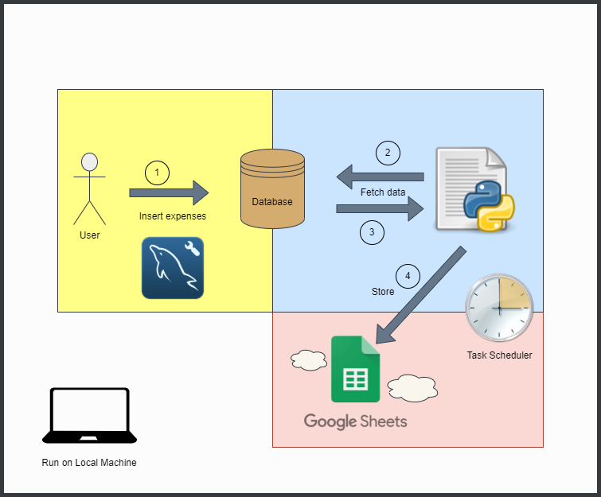
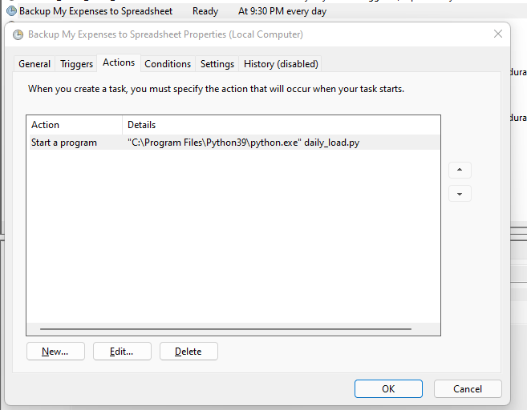

# Load Data From Local DB to Google Spreadsheet

This project is made by me and for me to backup my expenses data from local database (MySQL) to Google Spreadsheet, automatically every day which scheduled in Windows Task Scheduler.

For the high-level project flow will be shown by this image below:

From the image above, we can see that I insert my expenses to my local DB every day, then this program will automatically backup the data to my Google Spreadsheet.
To run it automatically, we need to configure this program on Windows Task Scheduler so that it will automatically run in my local machine. Configuration of Windows Task Scheduler will be shown below:

